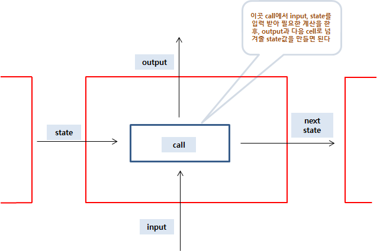

# Tensorflow에서 BasicDecoder에 넘겨 줄 수 있는 사용자 정의 RNN Wrapper Class를 만들어 보자.
아래 그림은 tf.nn.dynamic_rnn과 tf.contrib.seq2seq.dynamic_decode의 입력 구조를 비교한 그림이다.


* Cell의 대표적인 예: BasicRNNCell, GRUCell, BasicLSTMCell
* 이런 cell은 RNNCell을 상속받은 class들이다.
* RNNCell을 상속받아 사용자 정의 RNN Wrapper class를 만들어  BasicDecoder로 넘겨줄 수 있다.
* 초간단으로 만들어지 RNN Wrapper의 sample code를 살펴보자.

```python
from tensorflow.contrib.rnn import RNNCell

class MyRnnWrapper(RNNCell):
    # property(output_size, state_size) 2개와 call을 정의하면 된다.
    def __init__(self,state_dim,name=None):
        super(MyRnnWrapper, self).__init__(name=name)
        self.sate_size = state_dim

    @property
    def output_size(self):
        return self.sate_size  

    @property
    def state_size(self):
        return self.sate_size  

    def call(self, inputs, state):
        # 이 call 함수를 통해 cell과 cell이 연결된다.
        cell_output = inputs
        next_state = state 
        return cell_output, next_state 
```
* 위 코드에서 볼 수 있듯이, RNNCell을 상속받아 class MyRnnWrapper 정의한다.
* MyRnnWrapper에서 반드시 구현하여야 하는 부분은 perperty output_size와 state_size 이다. 그리고 call이라 이름 붙혀진 class method를 구현해야 한다.
* output_size는 RNN Model에서 출력될 결과물의 dimension이고 state_size는 cell과 cell를 연결하는 hidden state의 크기이다. 
* call 함수(method)는 input과 직전 cell에서 넘겨 받은 hidden state값을 넘겨 받아, 필요한 계산을 수행한 후, 다음 단계로 넘겨 줄 next_state와 cell_output를 구하는 역할을 수행한다.


